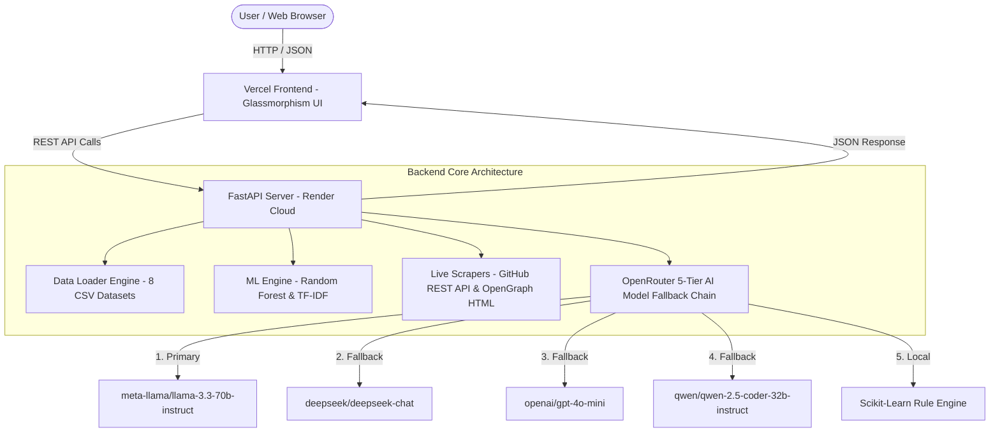

# 🧠 AI Career Mentor — Enterprise AI & ML Career Intelligence Platform

[](https://python.org)
[](https://fastapi.tiangolo.com)
[](https://scikit-learn.org)
[](https://ai-career-mentor-project.vercel.app/)
[](https://ai-career-mentor-3z0j.onrender.com)

**AI Career Mentor** is an advanced, production-ready **Hybrid AI & Machine Learning Career Intelligence Platform**. It combines **8 Kaggle Datasets (~1.6 Million Training Rows)** with a **5-Tier OpenRouter AI Model Fallback Chain** (`Llama 3.3 70B` ➔ `DeepSeek V3` ➔ `GPT-4o Mini` ➔ `Qwen 2.5 Coder` ➔ `Llama 3.1 8B`) to provide personalized career recommendations, salary estimations, ATS resume evaluations, mock interview answer grading, live GitHub code quality audits, and LinkedIn SEO profile reviews.

---

## 🌟 Live Demo Links

- 🌐 **Frontend (Vercel)**: [https://ai-career-mentor-project.vercel.app/](https://ai-career-mentor-project.vercel.app/)
- ⚡ **Backend API (Render)**: [https://ai-career-mentor-3z0j.onrender.com](https://ai-career-mentor-3z0j.onrender.com)
- 📖 **Interactive API Docs (Swagger UI)**: [https://ai-career-mentor-3z0j.onrender.com/docs](https://ai-career-mentor-3z0j.onrender.com/docs)

---

## 🚀 Key Feature Modules

### 1. 💰 AI Salary Predictor (INR Lakhs & USD)
- **Engine**: Trained Scikit-Learn `RandomForestRegressor` model (`salary_model.joblib`) on 1.6M dataset rows.
- **Output**: Predicts expected annual compensation in both **INR Lakhs/Crores (e.g. ₹38.5 Lakhs / yr)** and **USD ($46,000/yr)** with confidence range intervals and interactive Chart.js bar graphs.

### 2. 🧩 Career Finder ML
- **Engine**: TF-IDF Vectorization & Cosine Similarity Index on candidate education, experience, work style preferences, and skills.
- **Output**: Returns top 3 matching career paths with percentage confidence scores.

### 3. 📉 Skill Gap Analyzer
- **Engine**: Compares user's current technical skills against target industry benchmarks.
- **Output**: Generates **Readiness Score (%)**, estimated months to bridge, missing skill tags, and target certification requirements.

### 4. 🗺️ AI Career Roadmap Generator
- **Engine**: Dataset baseline parameters fused with OpenRouter LLMs.
- **Output**: Generates a 4-Phase step-by-step learning roadmap featuring **Key Skills, Recommended Books & Courses, Portfolio Project Ideas, Target Milestones, and Mentor Advice**.

### 5. 📄 Resume ATS Analyzer & Document Upload
- **Engine**: `pypdf` and `python-docx` text extraction parser + AI ATS Auditor.
- **Output**: Parses text from uploaded **PDF, DOCX, TXT** resume files and computes **ATS Score (0-100)**, keyword match percentage, overall rating, strengths, weaknesses, and improvement suggestions.

### 6. 🎙️ AI Mock Interview Simulator & Answer Evaluator
- **Engine**: 10-Question Bank Generator + OpenRouter Answer Grading Engine.
- **Question Categories**: LeetCode DSA & Algorithm Coding, System Design Architecture, Technical Deep Dives, and Behavioral STAR method scenarios.
- **Output**: Candidate answers are graded out of 10 with performance tier badges, missing technical points, constructive feedback, and ideal model answers.

### 7. 💼 LinkedIn Profile Auditor
- **Engine**: Live OpenGraph Metadata Scraper + AI Profile Auditor.
- **Output**: Fetches candidate public name, avatar photo, headline, and bio snippet, returning an **All-Star Profile Completeness Score (%)**, strengths, and recruiter search optimization tips.

### 8. 🐙 Live GitHub Developer Audit
- **Engine**: Live GitHub REST API (`api.github.com/users/{username}`) + OpenRouter Code Architect.
- **Output**: Displays candidate's real profile photo, public repos, total stars, followers, and top repository to calculate **Developer Score (/100), Code Quality Grade (A+, A, B+)**, and detected technology tags.

---

## 🏗️ Architecture & Data Flow



---

## 🛠️ Tech Stack & Requirements

- **Backend**: Python 3.11+, FastAPI 0.100+, Uvicorn, Pandas, Scikit-Learn, Joblib, BeautifulSoup4, PyPDF, Python-Docx
- **Frontend**: Vanilla HTML5, Custom Glassmorphism CSS3, JavaScript ES6+, FontAwesome 6, Chart.js
- **ML Datasets**: 8 Kaggle Datasets (`Dataset/` folder, ~1.6 Million Rows)
- **AI Models**: OpenRouter API (`llama-3.3-70b`, `deepseek-chat`, `gpt-4o-mini`, `qwen-2.5-coder`)

---

## 💻 Local Setup & Installation

### 1. Prerequisites
Make sure you have **Python 3.11+** and **Git** installed on your system.

### 2. Clone Repository
```bash
git clone https://github.com/Rupam852/AI-Career-Mentor.git
cd AI-Career-Mentor
```

### 3. Create Virtual Environment & Install Dependencies
```bash
# Windows
python -m venv .venv
.venv\Scripts\activate

# Linux / MacOS
python3 -m venv .venv
source .venv/bin/activate

# Install required packages
pip install -r requirements.txt
```

### 4. Configure Environment Variables
Create a `.env` file in the root directory (or set environment variables on your server):

```env
# OpenRouter API Key (Kept isolated in environment variables)
OPENROUTER_API_KEY=sk-or-v1-your_openrouter_api_key_here

# Optional: Gemini API Key fallback
GEMINI_API_KEY=your_gemini_api_key_here
```

> ⚠️ **Note**: Do NOT commit your actual API keys to GitHub! Use `.env` file or cloud environment variables.

### 5. Run Backend Server Locally
```bash
uvicorn app.main:app --reload --host 127.0.0.1 --port 8000
```
Open your browser and navigate to `http://127.0.0.1:8000` to see the application running locally!

---

## 📂 Project Directory Structure

```
AI-Career-Mentor/
├── app/
│   ├── static/
│   │   ├── index.html        # Main Application SPA UI
│   │   ├── styles.css        # Custom Glassmorphism & Responsive CSS
│   │   ├── app.js            # Frontend Controllers & Loading States
│   │   └── favicon.svg       # Glowing 3D AI Brain Favicon
│   ├── ai_service.py         # OpenRouter 5-Model Fallback Chain
│   ├── data_loader.py        # Dataset CSV Ingestion & Memory Management
│   ├── main.py               # FastAPI Routes & REST API Endpoints
│   ├── ml_engine.py          # Random Forest & TF-IDF Vectorizer Training
│   └── parsers.py            # PDF/DOCX Resume & GitHub API Fetchers
├── Dataset/                  # 8 Machine Learning Datasets (~1.6M Rows)
├── render.yaml               # Render Cloud Blueprint Config
├── requirements.txt          # Python Package Dependencies
└── README.md                 # Documentation
```

---

## 🌐 Production Deployment

### Render (Backend Deployment)
1. Connect your GitHub repository to [Render.com](https://render.com).
2. Create a new **Web Service** using:
   - **Environment**: `Python 3`
   - **Build Command**: `pip install -r requirements.txt`
   - **Start Command**: `uvicorn app.main:app --host 0.0.0.0 --port $PORT`
3. Add Environment Variable in Render Dashboard:
   - `OPENROUTER_API_KEY` = `sk-or-v1-your_openrouter_api_key_here`

### Vercel (Frontend Deployment)
1. Import repository to [Vercel.com](https://vercel.com).
2. Set Root Directory to `./` and deploy static assets.

---

## 📜 License & Author

Developed with ❤️ by **Rupam Bairagya**.  
Released under the [MIT License](LICENSE).
